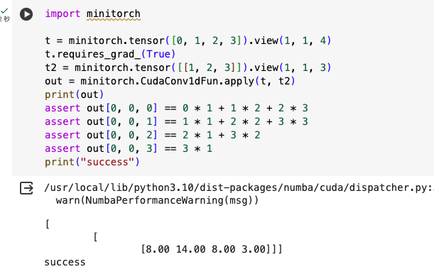
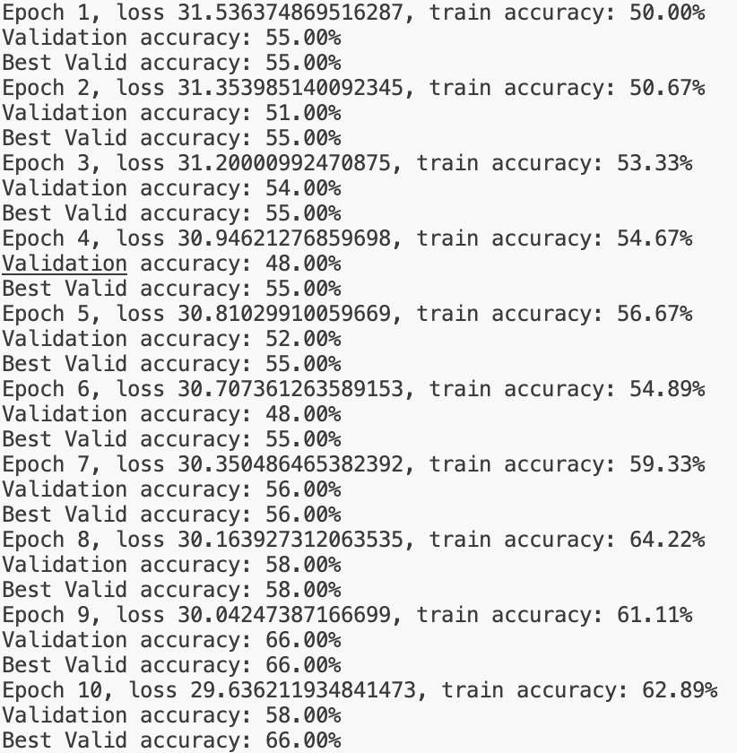
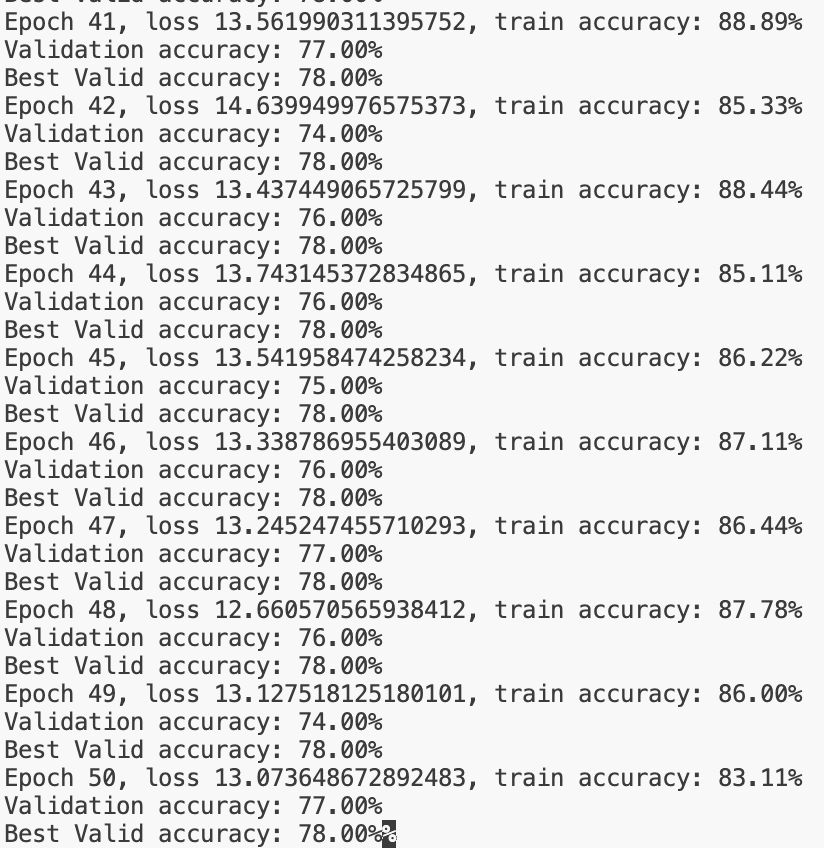
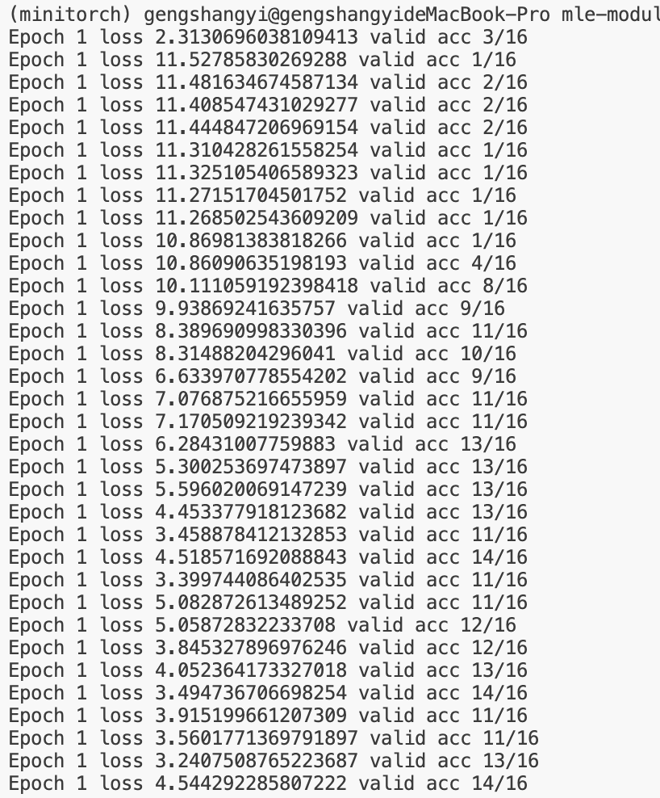
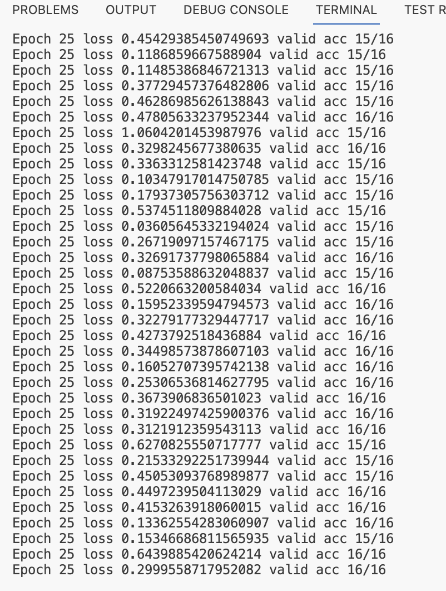

[](https://classroom.github.com/a/5gWs3A8E)
# MiniTorch Module 4


* Docs: https://minitorch.github.io/

* Overview: https://minitorch.github.io/module4.html

This module requires `fast_ops.py`, `cuda_ops.py`, `scalar.py`, `tensor_functions.py`, `tensor_data.py`, `tensor_ops.py`, `operators.py`, `module.py`, and `autodiff.py` from Module 3.


Additionally you will need to install and download the MNist library.

(On Mac, this may require installing the `wget` command)

```
pip install python-mnist
mnist_get_data.sh
```


* Tests:

```
python run_tests.py
```

This assignment requires the following files from the previous assignments. You can get these by running

```bash
python sync_previous_module.py previous-module-dir current-module-dir
```

The files that will be synced are:

        minitorch/tensor_data.py minitorch/tensor_functions.py minitorch/tensor_ops.py minitorch/fast_ops.py minitorch/cuda_ops.py minitorch/operators.py minitorch/module.py minitorch/autodiff.py minitorch/module.py project/run_manual.py project/run_scalar.py project/run_tensor.py project/run_fast_tensor.py project/parallel_check.py tests/test_tensor_general.py
## Task 4.4 cuda_conv
The test codes of cuda_conv are as follow:



## Task 4.5 Results

### Sentiment Training Logs
Below is the training log for Sentiment. The screenshot shows the beginning and ending parts of the log. The complete log can be found in sentiment.txt.

**78% Validation Accuracy**



### MNIST Training Logs

Below is the training log for MNIST. The screenshot shows the beginning and ending parts of the log. The complete log can be found in mnist.txt.

**Acc 16/16**




